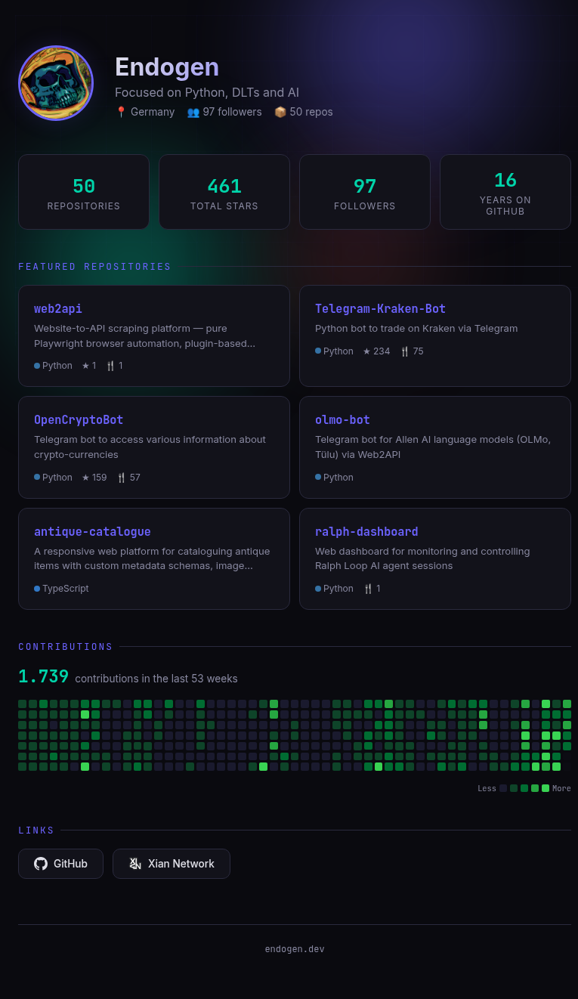

# endogen.dev

Personal landing page at [endogen.dev](https://endogen.dev) — auto-updating GitHub profile with dark theme.



## Features

- **Auto-updating** — pulls profile, stats, repos, and contributions from the GitHub API
- **Contribution heatmap** — 53 full weeks, scales to fill any screen width
- **Featured repos** — controlled via `repos.json` (edit to change what's shown)
- **Dark theme** — animated grid background, gradient orbs, JetBrains Mono + Inter
- **Responsive** — works on mobile and desktop
- **Zero backend** — pure static HTML + JS, served by nginx

## Customize

Edit `repos.json` to control which repositories are featured:

```json
[
  "repo-name-1",
  "repo-name-2",
  "repo-name-3"
]
```

If the file is missing or empty, it falls back to top repos sorted by stars.

## License

MIT
